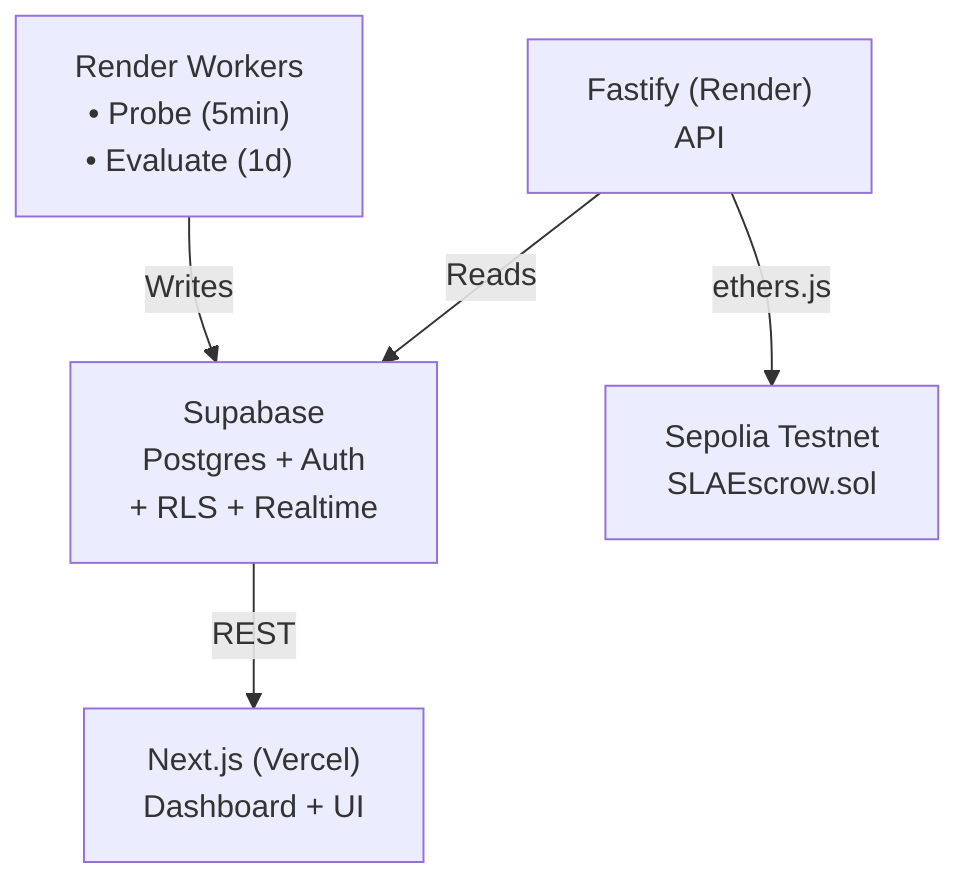

# SLA Sentinel

**Automated Third-Party API SLA Monitoring & Testnet Escrow Enforcement Platform**

A full-stack production-ready application demonstrating end-to-end Web3 engineering: continuous API monitoring, SLA breach detection, smart contract escrow enforcement, email/webhook notifications, and real-time dashboard.

[](https://www.typescriptlang.org/)
[](https://nextjs.org/)
[](https://soliditylang.org/)
[](./TESTING.md)

**Status:** Feature-complete and production-ready for Sepolia testnet deployment

---

## Problem

Companies integrate dozens of third-party APIs (payment gateways, KYC providers, SMS/email services) with contractually promised uptime % and latency ceilings. In practice:
- Nobody continuously measures the *actual* uptime/latency delivered
- SLA credits/penalties are negotiated on paper but enforced manually, slowly, inconsistently
- There's no neutral, tamper-evident record of "the vendor was down on this date for this long"

**SLA Sentinel** automates the measurement, breach detection, and programmatic on-chain enforcement of financial consequences.

---

## Features

### Monitoring & Detection
- **Continuous endpoint probing** with configurable intervals (30s-5min)
- **Uptime % and P95 latency aggregation** per evaluation period (daily/weekly/monthly)
- **SLA breach detection** with 2-consecutive-failures policy (avoids false positives)
- **Real-time status updates** via Supabase Realtime subscriptions

### Smart Contract Escrow
- **Sepolia testnet deployment** with escrow deposit/settlement/withdrawal
- **Automated breach settlement** transferring penalty to beneficiary
- **Oracle-based enforcement** with admin controls
- **Etherscan verification** for transparent contract source

### Notifications
- **Email notifications** via Resend on breach detection
- **Webhook delivery** with HMAC signatures and exponential backoff retry
- **Configurable recipients** per agreement

### Dashboard & UI
- **User authentication** (login + signup with organization creation)
- **Provider management** (CRUD operations for third-party APIs)
- **Agreement creation** (full UI form for SLA configuration)
- **Real-time monitoring dashboard** with live status indicators
- **Breach timeline** showing all violations with on-chain settlement links
- **Evaluation history** with pass/fail metrics
- **Responsive design** using Geist design system

### Security & Isolation
- **Row-Level Security (RLS)** scoping all data by organization
- **API authentication** via Supabase JWT tokens
- **Cross-org isolation** preventing data leakage
- **Rate limiting** on API endpoints

---

## Architecture



**Tech Stack:**
- **Frontend:** Next.js 14 (App Router), TypeScript, Tailwind CSS, Geist Design System
- **Backend:** Fastify, TypeScript, Zod validation
- **Database:** Supabase (Postgres + Auth + RLS + Realtime)
- **Smart Contract:** Solidity 0.8.24, Hardhat, Ethers.js v6
- **Notifications:** Resend (email), Webhooks with HMAC
- **Testing:** Vitest (unit), Hardhat + Chai (contracts), Playwright (E2E)
- **Deployment:** Vercel (frontend), Render (backend), Sepolia (contracts)

---

## Quick Start

### Prerequisites
- Node.js 18+ and pnpm 8+
- Supabase account ([free tier](https://supabase.com/))
- Sepolia testnet ETH ([faucet](https://sepoliafaucet.com/))
- Resend API key ([free tier](https://resend.com/))

### 1. Clone and Install
```bash
git clone <repo-url>
cd sla-sentinel
pnpm install
```

### 2. Configure Environment
```bash
# Copy example env files
cp apps/web/.env.example apps/web/.env.local
cp apps/api/.env.example apps/api/.env
cp contracts/.env.example contracts/.env
```

Edit the `.env` files with your credentials:

**apps/api/.env:**
```env
SUPABASE_URL=https://your-project.supabase.co
SUPABASE_SERVICE_ROLE_KEY=your_service_role_key
RESEND_API_KEY=re_your_resend_key
PORT=3002
```

**apps/web/.env.local:**
```env
NEXT_PUBLIC_SUPABASE_URL=https://your-project.supabase.co
NEXT_PUBLIC_SUPABASE_ANON_KEY=your_anon_key
NEXT_PUBLIC_API_BASE_URL=http://localhost:3002
```

**contracts/.env:**
```env
SEPOLIA_RPC_URL=https://eth-sepolia.g.alchemy.com/v2/your_api_key
ORACLE_PRIVATE_KEY=0x... # Testnet wallet only!
ETHERSCAN_API_KEY=your_etherscan_key
```

### 3. Set Up Database
```bash
cd apps/api
pnpm db:migrate  # Apply Supabase migrations
pnpm db:seed     # Seed demo data (optional)
```

### 4. Deploy Smart Contract
```bash
cd contracts
pnpm test        # Verify contract works
pnpm deploy:sepolia

# Save the deployed address to apps/api/.env:
# SLA_ESCROW_CONTRACT_ADDRESS=0x...
```

Verify on Etherscan:
```bash
npx hardhat verify --network sepolia <CONTRACT_ADDRESS> <ORACLE_ADDRESS>
```

### 5. Start Development Servers
```bash
# Terminal 1 — API
cd apps/api && pnpm dev

# Terminal 2 — Frontend
cd apps/web && pnpm dev

# Terminal 3 — Probe Worker
cd apps/api && pnpm worker
```

### 6. Open Dashboard
Visit [http://localhost:3000](http://localhost:3000)

**First Time Setup:**
1. Click "Sign up" to create account
2. Enter organization name and credentials
3. Navigate to "Providers" → Create provider
4. Navigate to "Agreements" → "Create Agreement"
5. Monitor on Dashboard

---

## Testing

**96+ tests** across unit, integration, and E2E levels.

```bash
# Run all unit tests (fast)
pnpm test

# Run specific workspace tests
pnpm --filter api test
pnpm --filter contracts test

# Run E2E tests (requires running app)
cd apps/web
pnpm test:e2e

# Run with UI
pnpm test:e2e:ui
```


---

## Deployment

### Smart Contract
**Network:** Sepolia Testnet  
**Contract:** SLAEscrow.sol  
**Address:** `[Deploy using DEPLOYMENT-CONTRACT.md]`  
**Verified:** [Etherscan link after deployment]

### Application

**Frontend (Vercel):**
1. Connect GitHub repo
2. Set environment variables
3. Deploy from `main` branch (auto)

**Backend (Render):**
1. Create Web Service from repo
2. Set environment variables
3. Deploy `apps/api`
4. Create Cron Jobs:
   - Probe Worker: `*/5 * * * *` (every 5 min)
   - Evaluator: `0 0 * * *` (daily at midnight)

**Database (Supabase):**
- Use production project
- Enable RLS policies
- Configure auth providers


---


<!-- ## Project Status

**Current Phase:** Phase 9 — Documentation & Polish (Complete)

**Completed Phases:**
- ✅ Phase 0: Project setup & monorepo scaffolding
- ✅ Phase 1: Database schema + RLS policies
- ✅ Phase 2: Probe system + scheduler
- ✅ Phase 3: Evaluation engine + aggregation
- ✅ Phase 4: Smart contract (SLAEscrow.sol)
- ✅ Phase 5: REST API + auth + CRUD
- ✅ Phase 6: Notifications (email + webhooks)
- ✅ Phase 7: Frontend dashboard + real data
- ✅ Phase 8: Deployment configurations
- ⏳ Phase 9: Documentation (current)

**Additional Work:**
- ✅ Critical bug fixes (API response format + missing routes)
- ✅ Deferred tests (RLS + API integration + E2E)
- ✅ High-priority features (Create Agreement + Signup) -->


---

## Key Decisions & Trade-offs

### Why Sepolia Testnet?
- **Portfolio scope:** Demonstrates blockchain integration without real funds
- **Fast iteration:** No gas costs, instant faucet ETH
- **Production path:** Code is mainnet-ready, just change network config

### Why Supabase?
- **RLS out-of-box:** Multi-tenant data isolation without custom middleware
- **Realtime:** Live dashboard updates via Postgres LISTEN/NOTIFY
- **Auth integrated:** JWT validation works with Fastify auth middleware

### Why Monorepo?
- **Shared types:** Import backend types in frontend (type safety)
- **Atomic deployments:** Deploy related changes together
- **Single command:** `pnpm test` runs all workspace tests


---

## License

MIT (portfolio/demo project)

---

