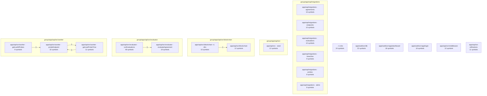

# Architecture Overview

This codebase decomposes into 20 functional communities. The diagram below shows the largest 20 and the cross-community calls between them.

## Communities by Size

| Community | Files | Symbols | Cohesion | Hub |
|-----------|-------|---------|----------|-----|
| [apps\api\src\evaluator · runEvaluations](communities/1-apps-api-src-evaluator-runevaluations.md) | 2 | 48 | 95% | `runEvaluations` |
| [apps\api\src\worker · probeEndpoint](communities/2-apps-api-src-worker-probeendpoint.md) | 3 | 32 | 94% | `probeEndpoint` |
| [. +1 dirs](communities/3-1-dirs.md) | 2 | 24 | 100% | `deliverWebhook` |
| [apps\web\src\lib](communities/4-apps-web-src-lib.md) | 1 | 22 | 98% | `request` |
| [apps\api\src\evaluator · evaluateAgreement](communities/5-apps-api-src-evaluator-evaluateagreement.md) | 3 | 19 | 92% | `evaluateAgreement` |
| [apps\web\src\app\dashboard](communities/6-apps-web-src-app-dashboard.md) | 1 | 18 | 96% | `DashboardPage` |
| [apps\api\migrations · agreements](communities/7-apps-api-migrations-agreements.md) | 1 | 16 | 100% | `agreements` |
| [apps\web\src\app\login](communities/8-apps-web-src-app-login.md) | 1 | 16 | 100% | `LoginPage` |
| [apps\api\src\blockchain](communities/9-apps-api-src-blockchain.md) | 1 | 12 | 94% | `getEscrowStatus` |
| [apps\api\src\middleware](communities/10-apps-api-src-middleware.md) | 1 | 12 | 100% | `authMiddleware` |
| [apps\api\src · seed](communities/11-apps-api-src-seed.md) | 1 | 12 | 100% | `seed` |
| [apps\api\src\notifications](communities/12-apps-api-src-notifications.md) | 1 | 11 | 94% | `sendBreachEmail` |
| [apps\api\src\worker · getLastProbeTime](communities/13-apps-api-src-worker-getlastprobetime.md) | 2 | 11 | 86% | `getLastProbeTime` |
| [apps\api\src\blockchain +1 dirs](communities/14-apps-api-src-blockchain-1-dirs.md) | 2 | 10 | 87% | `recordOutcomeOnChain` |
| [apps\api\migrations · endpoints](communities/15-apps-api-migrations-endpoints.md) | 1 | 10 | 100% | `endpoints` |
| [apps\api\migrations · evaluations](communities/16-apps-api-migrations-evaluations.md) | 1 | 10 | 100% | `evaluations` |
| [apps\api\src\worker · getLastNProbes](communities/17-apps-api-src-worker-getlastnprobes.md) | 2 | 9 | 93% | `getLastNProbes` |
| [apps\api\migrations · breaches](communities/18-apps-api-migrations-breaches.md) | 1 | 9 | 100% | `breaches` |
| [apps\api\migrations · alerts](communities/19-apps-api-migrations-alerts.md) | 1 | 8 | 100% | `alerts` |
| [apps\api\migrations · audit_log](communities/20-apps-api-migrations-audit-log.md) | 1 | 8 | 100% | `audit_log` |

