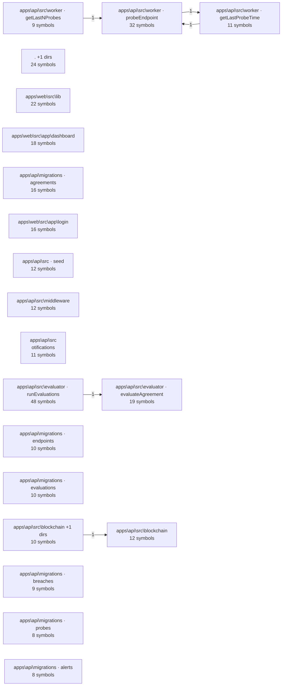

# sla-enforcement-layer-for-third-party-api

Auto-generated by `gortex wiki` on 2026-06-20. 1631 nodes, 2527 edges across 159 files.

## At a Glance

| Metric | Value |
|--------|-------|
| Files | 159 |
| Symbols | 1365 |
| Relationships | 2527 |
| Communities | 20 |
| Processes | 50 |
| Contracts | 73 |
| Hotspots | 4 |
| Cycles | 0 |

## Community Map



## Communities

| Community | Size | Cohesion | Files | Page |
|-----------|------|----------|-------|------|
| apps\api\src\evaluator · runEvaluations | 48 | 95% | 2 | [open](communities/1-apps-api-src-evaluator-runevaluations.md) |
| apps\api\src\worker · probeEndpoint | 32 | 94% | 3 | [open](communities/2-apps-api-src-worker-probeendpoint.md) |
| . +1 dirs | 24 | 100% | 2 | [open](communities/3-1-dirs.md) |
| apps\web\src\lib | 22 | 98% | 1 | [open](communities/4-apps-web-src-lib.md) |
| apps\api\src\evaluator · evaluateAgreement | 19 | 92% | 3 | [open](communities/5-apps-api-src-evaluator-evaluateagreement.md) |
| apps\web\src\app\dashboard | 18 | 96% | 1 | [open](communities/6-apps-web-src-app-dashboard.md) |
| apps\api\migrations · agreements | 16 | 100% | 1 | [open](communities/7-apps-api-migrations-agreements.md) |
| apps\web\src\app\login | 16 | 100% | 1 | [open](communities/8-apps-web-src-app-login.md) |
| apps\api\src\blockchain | 12 | 94% | 1 | [open](communities/9-apps-api-src-blockchain.md) |
| apps\api\src\middleware | 12 | 100% | 1 | [open](communities/10-apps-api-src-middleware.md) |
| apps\api\src · seed | 12 | 100% | 1 | [open](communities/11-apps-api-src-seed.md) |
| apps\api\src\notifications | 11 | 94% | 1 | [open](communities/12-apps-api-src-notifications.md) |
| apps\api\src\worker · getLastProbeTime | 11 | 86% | 2 | [open](communities/13-apps-api-src-worker-getlastprobetime.md) |
| apps\api\src\blockchain +1 dirs | 10 | 87% | 2 | [open](communities/14-apps-api-src-blockchain-1-dirs.md) |
| apps\api\migrations · endpoints | 10 | 100% | 1 | [open](communities/15-apps-api-migrations-endpoints.md) |
| apps\api\migrations · evaluations | 10 | 100% | 1 | [open](communities/16-apps-api-migrations-evaluations.md) |
| apps\api\src\worker · getLastNProbes | 9 | 93% | 2 | [open](communities/17-apps-api-src-worker-getlastnprobes.md) |
| apps\api\migrations · breaches | 9 | 100% | 1 | [open](communities/18-apps-api-migrations-breaches.md) |
| apps\api\migrations · alerts | 8 | 100% | 1 | [open](communities/19-apps-api-migrations-alerts.md) |
| apps\api\migrations · audit_log | 8 | 100% | 1 | [open](communities/20-apps-api-migrations-audit-log.md) |

## Sections

- [Architecture](architecture.md) — community-level overview
- [Processes](processes/) — execution flows with sequence diagrams
- [API Contracts](contracts/api-surface.md) — HTTP/gRPC/GraphQL surfaces
- [Hotspots](analysis/hotspots.md) — high-coupling symbols
- [Cycles](analysis/cycles.md) — circular dependencies
- [Semantic](analysis/semantic.md) — edge confidence & coverage
- [Changelog & ownership](changelog.md) — `gortex docs` bundle

## How to Explore

```
smart_context with task: "understand this codebase"
get_repo_outline
get_communities with id: "community-12"
```
