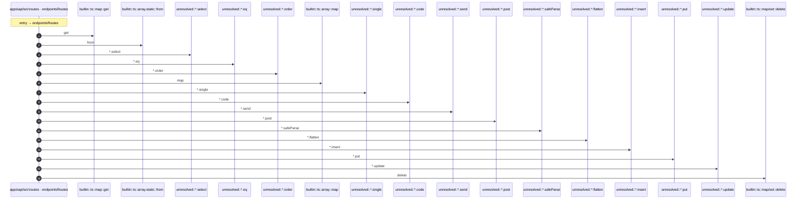

# Process: endpointsRoutes flow

17 steps across 1 files. Entry: `apps\api\src\routes\endpoints.ts::endpointsRoutes` (score 247.50).

## Flow

## Steps

| # | Depth | Symbol | File |
|---|-------|--------|------|
| 1 | 0 | `endpointsRoutes` | `apps\api\src\routes\endpoints.ts` |
| 2 | 1 | `builtin::ts::map::get` | `` |
| 3 | 1 | `builtin::ts::array.static::from` | `` |
| 4 | 1 | `unresolved::*.select` | `` |
| 5 | 1 | `unresolved::*.eq` | `` |
| 6 | 1 | `unresolved::*.order` | `` |
| 7 | 1 | `builtin::ts::array::map` | `` |
| 8 | 1 | `unresolved::*.single` | `` |
| 9 | 1 | `unresolved::*.code` | `` |
| 10 | 1 | `unresolved::*.send` | `` |
| 11 | 1 | `unresolved::*.post` | `` |
| 12 | 1 | `unresolved::*.safeParse` | `` |
| 13 | 1 | `unresolved::*.flatten` | `` |
| 14 | 1 | `unresolved::*.insert` | `` |
| 15 | 1 | `unresolved::*.put` | `` |
| 16 | 1 | `unresolved::*.update` | `` |
| 17 | 1 | `builtin::ts::map/set::delete` | `` |

## Files Touched

- `apps\api\src\routes\endpoints.ts`

