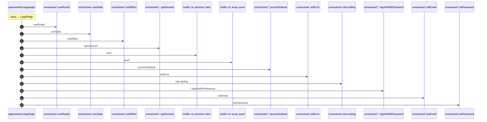

# Process: LoginPage flow

13 steps across 1 files. Entry: `apps\web\src\app\login\page.tsx::LoginPage` (score 54.00).

## Flow

## Steps

| # | Depth | Symbol | File |
|---|-------|--------|------|
| 1 | 0 | `LoginPage` | `apps\web\src\app\login\page.tsx` |
| 2 | 1 | `unresolved::useRouter` | `` |
| 3 | 1 | `unresolved::useState` | `` |
| 4 | 1 | `unresolved::useEffect` | `` |
| 5 | 1 | `unresolved::*.getSession` | `` |
| 6 | 1 | `builtin::ts::promise::then` | `` |
| 7 | 1 | `builtin::ts::array::push` | `` |
| 8 | 1 | `unresolved::*.preventDefault` | `` |
| 9 | 1 | `unresolved::setError` | `` |
| 10 | 1 | `unresolved::setLoading` | `` |
| 11 | 1 | `unresolved::*.signInWithPassword` | `` |
| 12 | 1 | `unresolved::setEmail` | `` |
| 13 | 1 | `unresolved::setPassword` | `` |

## Files Touched

- `apps\web\src\app\login\page.tsx`

