# Process: runEvaluations flow

36 steps across 3 files. Entry: `apps\api\src\evaluator\evaluation-job.ts::runEvaluations` (score 39.49).

## Flow

```mermaid
sequenceDiagram
  autonumber
  participant c_apps\api\src\evaluator_·_runEvaluations as apps\api\src\evaluator · runEvaluations
  participant n_builtin_ts_console_log as builtin::ts::console::log
  participant n_unresolved_createClient as unresolved::createClient
  participant n_unresolved___toISOString as unresolved::*.toISOString
  participant n_builtin_ts_array_static_from as builtin::ts::array.static::from
  participant n_unresolved___select as unresolved::*.select
  participant n_unresolved___eq as unresolved::*.eq
  participant n_unresolved___lt as unresolved::*.lt
  participant n_unresolved___is as unresolved::*.is
  participant n_builtin_ts_console_error as builtin::ts::console::error
  participant n_builtin_ts_array_map as builtin::ts::array::map
  participant n_unresolved___in as unresolved::*.in
  participant n_unresolved___gte as unresolved::*.gte
  participant n_unresolved___lte as unresolved::*.lte
  participant c_apps\api\src\evaluator_·_evaluateAgreement as apps\api\src\evaluator · evaluateAgreement
  participant n_builtin_ts_array_filter as builtin::ts::array::filter
  participant n_builtin_ts_array_sort as builtin::ts::array::sort
  participant n_unresolved___ceil as unresolved::*.ceil
  participant n_unresolved___max as unresolved::*.max
  participant n_builtin_ts_array_push as builtin::ts::array::push
  participant n_builtin_ts_number_toFixed as builtin::ts::number::toFixed
  participant n_unresolved___join as unresolved::*.join
  participant n_unresolved___insert as unresolved::*.insert
  participant n_unresolved___single as unresolved::*.single
  participant n_unresolved_sendBreachEmail as unresolved::sendBreachEmail
  participant n_unresolved_recordOutcomeOnChain as unresolved::recordOutcomeOnChain
  participant n_unresolved___update as unresolved::*.update

  Note over c_apps\api\src\evaluator_·_runEvaluations: entry → runEvaluations
  c_apps\api\src\evaluator_·_runEvaluations->>n_builtin_ts_console_log: log
  c_apps\api\src\evaluator_·_runEvaluations->>c_apps\api\src\evaluator_·_runEvaluations: findDueAgreements
  c_apps\api\src\evaluator_·_runEvaluations->>c_apps\api\src\evaluator_·_runEvaluations: getSupabaseClient
  c_apps\api\src\evaluator_·_runEvaluations->>n_unresolved_createClient: createClient
  c_apps\api\src\evaluator_·_runEvaluations->>n_unresolved___toISOString: *.toISOString
  c_apps\api\src\evaluator_·_runEvaluations->>n_builtin_ts_array_static_from: from
  c_apps\api\src\evaluator_·_runEvaluations->>n_unresolved___select: *.select
  c_apps\api\src\evaluator_·_runEvaluations->>n_unresolved___eq: *.eq
  c_apps\api\src\evaluator_·_runEvaluations->>n_unresolved___lt: *.lt
  c_apps\api\src\evaluator_·_runEvaluations->>n_unresolved___is: *.is
  c_apps\api\src\evaluator_·_runEvaluations->>n_builtin_ts_console_error: error
  c_apps\api\src\evaluator_·_runEvaluations->>n_builtin_ts_array_map: map
  c_apps\api\src\evaluator_·_runEvaluations->>c_apps\api\src\evaluator_·_runEvaluations: fetchProbesForPeriod
  c_apps\api\src\evaluator_·_runEvaluations->>n_unresolved___in: *.in
  c_apps\api\src\evaluator_·_runEvaluations->>n_unresolved___gte: *.gte
  c_apps\api\src\evaluator_·_runEvaluations->>n_unresolved___lte: *.lte
  c_apps\api\src\evaluator_·_runEvaluations->>c_apps\api\src\evaluator_·_evaluateAgreement: evaluateAgreement
  c_apps\api\src\evaluator_·_evaluateAgreement->>c_apps\api\src\evaluator_·_evaluateAgreement: aggregateProbes
  c_apps\api\src\evaluator_·_evaluateAgreement->>c_apps\api\src\evaluator_·_evaluateAgreement: computeUptimePct
  c_apps\api\src\evaluator_·_evaluateAgreement->>n_builtin_ts_array_filter: filter
  c_apps\api\src\evaluator_·_evaluateAgreement->>c_apps\api\src\evaluator_·_evaluateAgreement: computeP95Latency
  c_apps\api\src\evaluator_·_evaluateAgreement->>n_builtin_ts_array_sort: sort
  c_apps\api\src\evaluator_·_evaluateAgreement->>n_unresolved___ceil: *.ceil
  c_apps\api\src\evaluator_·_evaluateAgreement->>n_unresolved___max: *.max
  c_apps\api\src\evaluator_·_evaluateAgreement->>n_builtin_ts_array_push: push
  c_apps\api\src\evaluator_·_evaluateAgreement->>n_builtin_ts_number_toFixed: toFixed
  c_apps\api\src\evaluator_·_evaluateAgreement->>n_unresolved___join: *.join
  c_apps\api\src\evaluator_·_runEvaluations->>c_apps\api\src\evaluator_·_runEvaluations: saveEvaluation
  c_apps\api\src\evaluator_·_runEvaluations->>n_unresolved___insert: *.insert
  c_apps\api\src\evaluator_·_runEvaluations->>n_unresolved___single: *.single
  c_apps\api\src\evaluator_·_runEvaluations->>c_apps\api\src\evaluator_·_runEvaluations: saveBreach
  c_apps\api\src\evaluator_·_runEvaluations->>n_unresolved_sendBreachEmail: sendBreachEmail
  c_apps\api\src\evaluator_·_runEvaluations->>n_unresolved_recordOutcomeOnChain: recordOutcomeOnChain
  c_apps\api\src\evaluator_·_runEvaluations->>c_apps\api\src\evaluator_·_runEvaluations: markAgreementEvaluated
  c_apps\api\src\evaluator_·_runEvaluations->>n_unresolved___update: *.update
```

## Steps

| # | Depth | Symbol | File |
|---|-------|--------|------|
| 1 | 0 | `runEvaluations` | `apps\api\src\evaluator\evaluation-job.ts` |
| 2 | 1 | `builtin::ts::console::log` | `` |
| 3 | 1 | `findDueAgreements` | `apps\api\src\evaluator\evaluation-job.ts` |
| 4 | 2 | `getSupabaseClient` | `apps\api\src\evaluator\evaluation-job.ts` |
| 5 | 3 | `unresolved::createClient` | `` |
| 6 | 2 | `unresolved::*.toISOString` | `` |
| 7 | 2 | `builtin::ts::array.static::from` | `` |
| 8 | 2 | `unresolved::*.select` | `` |
| 9 | 2 | `unresolved::*.eq` | `` |
| 10 | 2 | `unresolved::*.lt` | `` |
| 11 | 2 | `unresolved::*.is` | `` |
| 12 | 2 | `builtin::ts::console::error` | `` |
| 13 | 2 | `builtin::ts::array::map` | `` |
| 14 | 1 | `fetchProbesForPeriod` | `apps\api\src\evaluator\evaluation-job.ts` |
| 15 | 2 | `unresolved::*.in` | `` |
| 16 | 2 | `unresolved::*.gte` | `` |
| 17 | 2 | `unresolved::*.lte` | `` |
| 18 | 1 | `evaluateAgreement` | `apps\api\src\evaluator\evaluation.ts` |
| 19 | 2 | `aggregateProbes` | `apps\api\src\evaluator\aggregation.ts` |
| 20 | 3 | `computeUptimePct` | `apps\api\src\evaluator\aggregation.ts` |
| 21 | 4 | `builtin::ts::array::filter` | `` |
| 22 | 3 | `computeP95Latency` | `apps\api\src\evaluator\aggregation.ts` |
| 23 | 4 | `builtin::ts::array::sort` | `` |
| 24 | 4 | `unresolved::*.ceil` | `` |
| 25 | 4 | `unresolved::*.max` | `` |
| 26 | 2 | `builtin::ts::array::push` | `` |
| 27 | 2 | `builtin::ts::number::toFixed` | `` |
| 28 | 2 | `unresolved::*.join` | `` |
| 29 | 1 | `saveEvaluation` | `apps\api\src\evaluator\evaluation-job.ts` |
| 30 | 2 | `unresolved::*.insert` | `` |
| 31 | 2 | `unresolved::*.single` | `` |
| 32 | 1 | `saveBreach` | `apps\api\src\evaluator\evaluation-job.ts` |
| 33 | 1 | `unresolved::sendBreachEmail` | `` |
| 34 | 1 | `unresolved::recordOutcomeOnChain` | `` |
| 35 | 1 | `markAgreementEvaluated` | `apps\api\src\evaluator\evaluation-job.ts` |
| 36 | 2 | `unresolved::*.update` | `` |

## Files Touched

- `apps\api\src\evaluator\aggregation.ts`
- `apps\api\src\evaluator\evaluation-job.ts`
- `apps\api\src\evaluator\evaluation.ts`

