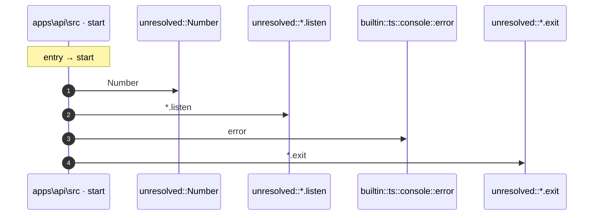

# Process: start flow

5 steps across 1 files. Entry: `apps\api\src\index.ts::start` (score 18.00).

## Flow

## Steps

| # | Depth | Symbol | File |
|---|-------|--------|------|
| 1 | 0 | `start` | `apps\api\src\index.ts` |
| 2 | 1 | `unresolved::Number` | `` |
| 3 | 1 | `unresolved::*.listen` | `` |
| 4 | 1 | `builtin::ts::console::error` | `` |
| 5 | 1 | `unresolved::*.exit` | `` |

## Files Touched

- `apps\api\src\index.ts`

