# Process: runProbes flow

28 steps across 2 files. Entry: `apps\api\src\worker\scheduler.ts::runProbes` (score 17.55).

## Flow

```mermaid
sequenceDiagram
  autonumber
  participant c_apps\api\src\worker_·_probeEndpoint as apps\api\src\worker · probeEndpoint
  participant n_builtin_ts_console_log as builtin::ts::console::log
  participant n_unresolved_createClient as unresolved::createClient
  participant n_builtin_ts_array_static_from as builtin::ts::array.static::from
  participant n_unresolved___select as unresolved::*.select
  participant n_unresolved___eq as unresolved::*.eq
  participant n_builtin_ts_console_error as builtin::ts::console::error
  participant n_builtin_ts_array_map as builtin::ts::array::map
  participant c_apps\api\src\worker_·_getLastProbeTime as apps\api\src\worker · getLastProbeTime
  participant n_unresolved___order as unresolved::*.order
  participant n_unresolved___limit as unresolved::*.limit
  participant n_unresolved___single as unresolved::*.single
  participant n_unresolved___getTime as unresolved::*.getTime
  participant n_unresolved___now as unresolved::*.now
  participant n_unresolved_setTimeout as unresolved::setTimeout
  participant n_unresolved___abort as unresolved::*.abort
  participant n_unresolved_fetch as unresolved::fetch
  participant n_unresolved_clearTimeout as unresolved::clearTimeout
  participant n_unresolved___round as unresolved::*.round
  participant n_builtin_ts_array_string_includes as builtin::ts::array/string::includes
  participant n_unresolved___insert as unresolved::*.insert
  participant n_unresolved___toISOString as unresolved::*.toISOString
  participant n_builtin_ts_promise_static_allSettled as builtin::ts::promise.static::allSettled

  Note over c_apps\api\src\worker_·_probeEndpoint: entry → runProbes
  c_apps\api\src\worker_·_probeEndpoint->>n_builtin_ts_console_log: log
  c_apps\api\src\worker_·_probeEndpoint->>c_apps\api\src\worker_·_probeEndpoint: getActiveEndpoints
  c_apps\api\src\worker_·_probeEndpoint->>c_apps\api\src\worker_·_probeEndpoint: getSupabaseClient
  c_apps\api\src\worker_·_probeEndpoint->>n_unresolved_createClient: createClient
  c_apps\api\src\worker_·_probeEndpoint->>n_builtin_ts_array_static_from: from
  c_apps\api\src\worker_·_probeEndpoint->>n_unresolved___select: *.select
  c_apps\api\src\worker_·_probeEndpoint->>n_unresolved___eq: *.eq
  c_apps\api\src\worker_·_probeEndpoint->>n_builtin_ts_console_error: error
  c_apps\api\src\worker_·_probeEndpoint->>n_builtin_ts_array_map: map
  c_apps\api\src\worker_·_probeEndpoint->>c_apps\api\src\worker_·_getLastProbeTime: shouldProbeEndpoint
  c_apps\api\src\worker_·_getLastProbeTime->>c_apps\api\src\worker_·_getLastProbeTime: getLastProbeTime
  c_apps\api\src\worker_·_getLastProbeTime->>n_unresolved___order: *.order
  c_apps\api\src\worker_·_getLastProbeTime->>n_unresolved___limit: *.limit
  c_apps\api\src\worker_·_getLastProbeTime->>n_unresolved___single: *.single
  c_apps\api\src\worker_·_getLastProbeTime->>n_unresolved___getTime: *.getTime
  c_apps\api\src\worker_·_probeEndpoint->>c_apps\api\src\worker_·_probeEndpoint: probeEndpoint
  c_apps\api\src\worker_·_probeEndpoint->>n_unresolved___now: *.now
  c_apps\api\src\worker_·_probeEndpoint->>n_unresolved_setTimeout: setTimeout
  c_apps\api\src\worker_·_probeEndpoint->>n_unresolved___abort: *.abort
  c_apps\api\src\worker_·_probeEndpoint->>n_unresolved_fetch: fetch
  c_apps\api\src\worker_·_probeEndpoint->>n_unresolved_clearTimeout: clearTimeout
  c_apps\api\src\worker_·_probeEndpoint->>n_unresolved___round: *.round
  c_apps\api\src\worker_·_probeEndpoint->>n_builtin_ts_array_string_includes: includes
  c_apps\api\src\worker_·_probeEndpoint->>c_apps\api\src\worker_·_probeEndpoint: saveProbeResult
  c_apps\api\src\worker_·_probeEndpoint->>n_unresolved___insert: *.insert
  c_apps\api\src\worker_·_probeEndpoint->>n_unresolved___toISOString: *.toISOString
  c_apps\api\src\worker_·_probeEndpoint->>n_builtin_ts_promise_static_allSettled: allSettled
```

## Steps

| # | Depth | Symbol | File |
|---|-------|--------|------|
| 1 | 0 | `runProbes` | `apps\api\src\worker\scheduler.ts` |
| 2 | 1 | `builtin::ts::console::log` | `` |
| 3 | 1 | `getActiveEndpoints` | `apps\api\src\worker\scheduler.ts` |
| 4 | 2 | `getSupabaseClient` | `apps\api\src\worker\probe-runner.ts` |
| 5 | 3 | `unresolved::createClient` | `` |
| 6 | 2 | `builtin::ts::array.static::from` | `` |
| 7 | 2 | `unresolved::*.select` | `` |
| 8 | 2 | `unresolved::*.eq` | `` |
| 9 | 2 | `builtin::ts::console::error` | `` |
| 10 | 1 | `builtin::ts::array::map` | `` |
| 11 | 1 | `shouldProbeEndpoint` | `apps\api\src\worker\scheduler.ts` |
| 12 | 2 | `getLastProbeTime` | `apps\api\src\worker\probe-runner.ts` |
| 13 | 3 | `unresolved::*.order` | `` |
| 14 | 3 | `unresolved::*.limit` | `` |
| 15 | 3 | `unresolved::*.single` | `` |
| 16 | 2 | `unresolved::*.getTime` | `` |
| 17 | 1 | `probeEndpoint` | `apps\api\src\worker\probe-runner.ts` |
| 18 | 2 | `unresolved::*.now` | `` |
| 19 | 2 | `unresolved::setTimeout` | `` |
| 20 | 2 | `unresolved::*.abort` | `` |
| 21 | 2 | `unresolved::fetch` | `` |
| 22 | 2 | `unresolved::clearTimeout` | `` |
| 23 | 2 | `unresolved::*.round` | `` |
| 24 | 2 | `builtin::ts::array/string::includes` | `` |
| 25 | 1 | `saveProbeResult` | `apps\api\src\worker\probe-runner.ts` |
| 26 | 2 | `unresolved::*.insert` | `` |
| 27 | 2 | `unresolved::*.toISOString` | `` |
| 28 | 1 | `builtin::ts::promise.static::allSettled` | `` |

## Files Touched

- `apps\api\src\worker\probe-runner.ts`
- `apps\api\src\worker\scheduler.ts`

