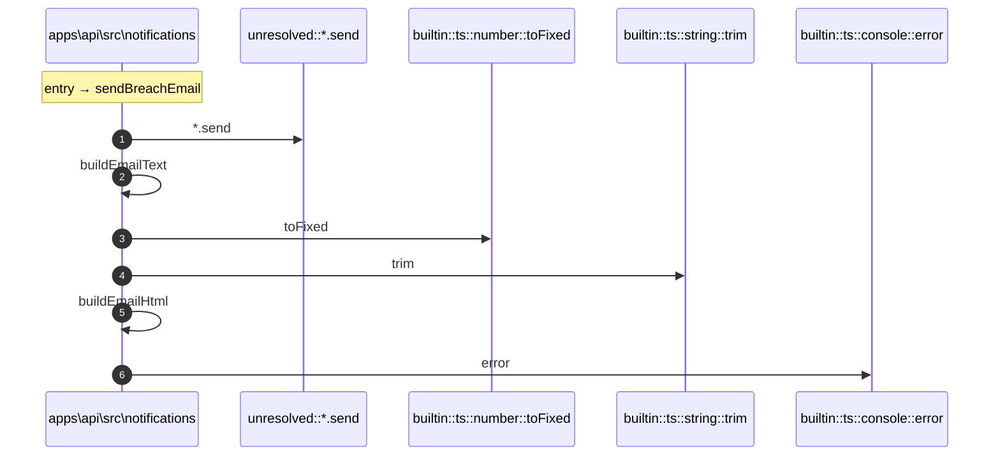

# Process: sendBreachEmail flow

7 steps across 1 files. Entry: `apps\api\src\notifications\email.ts::sendBreachEmail` (score 15.00).

## Flow

## Steps

| # | Depth | Symbol | File |
|---|-------|--------|------|
| 1 | 0 | `sendBreachEmail` | `apps\api\src\notifications\email.ts` |
| 2 | 1 | `unresolved::*.send` | `` |
| 3 | 1 | `buildEmailText` | `apps\api\src\notifications\email.ts` |
| 4 | 2 | `builtin::ts::number::toFixed` | `` |
| 5 | 2 | `builtin::ts::string::trim` | `` |
| 6 | 1 | `buildEmailHtml` | `apps\api\src\notifications\email.ts` |
| 7 | 1 | `builtin::ts::console::error` | `` |

## Files Touched

- `apps\api\src\notifications\email.ts`

