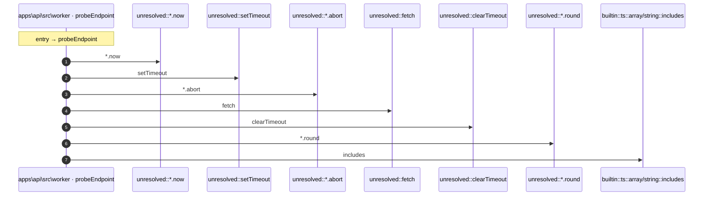

# Process: probeEndpoint flow

8 steps across 1 files. Entry: `apps\api\src\worker\probe-runner.ts::probeEndpoint` (score 14.62).

## Flow

## Steps

| # | Depth | Symbol | File |
|---|-------|--------|------|
| 1 | 0 | `probeEndpoint` | `apps\api\src\worker\probe-runner.ts` |
| 2 | 1 | `unresolved::*.now` | `` |
| 3 | 1 | `unresolved::setTimeout` | `` |
| 4 | 1 | `unresolved::*.abort` | `` |
| 5 | 1 | `unresolved::fetch` | `` |
| 6 | 1 | `unresolved::clearTimeout` | `` |
| 7 | 1 | `unresolved::*.round` | `` |
| 8 | 1 | `builtin::ts::array/string::includes` | `` |

## Files Touched

- `apps\api\src\worker\probe-runner.ts`

