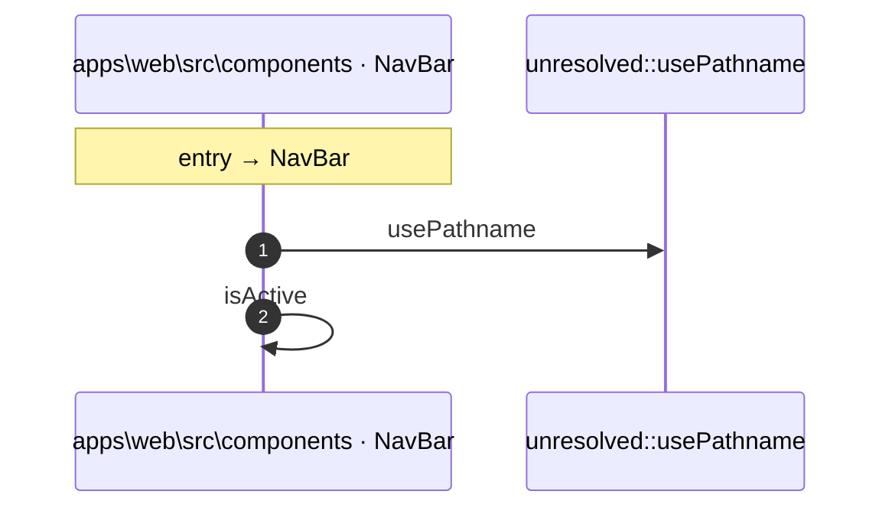

# Process: NavBar flow

3 steps across 1 files. Entry: `apps\web\src\components\NavBar.tsx::NavBar` (score 12.00).

## Flow

## Steps

| # | Depth | Symbol | File |
|---|-------|--------|------|
| 1 | 0 | `NavBar` | `apps\web\src\components\NavBar.tsx` |
| 2 | 1 | `unresolved::usePathname` | `` |
| 3 | 1 | `isActive` | `apps\web\src\components\NavBar.tsx` |

## Files Touched

- `apps\web\src\components\NavBar.tsx`

