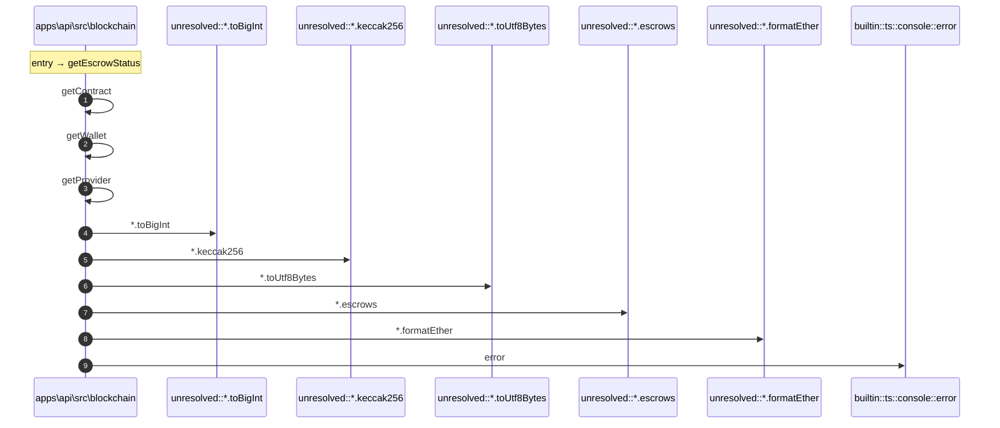

# Process: getEscrowStatus flow

10 steps across 1 files. Entry: `apps\api\src\blockchain\escrow-client.ts::getEscrowStatus` (score 10.50).

## Flow

## Steps

| # | Depth | Symbol | File |
|---|-------|--------|------|
| 1 | 0 | `getEscrowStatus` | `apps\api\src\blockchain\escrow-client.ts` |
| 2 | 1 | `getContract` | `apps\api\src\blockchain\escrow-client.ts` |
| 3 | 2 | `getWallet` | `apps\api\src\blockchain\escrow-client.ts` |
| 4 | 3 | `getProvider` | `apps\api\src\blockchain\escrow-client.ts` |
| 5 | 1 | `unresolved::*.toBigInt` | `` |
| 6 | 1 | `unresolved::*.keccak256` | `` |
| 7 | 1 | `unresolved::*.toUtf8Bytes` | `` |
| 8 | 1 | `unresolved::*.escrows` | `` |
| 9 | 1 | `unresolved::*.formatEther` | `` |
| 10 | 1 | `builtin::ts::console::error` | `` |

## Files Touched

- `apps\api\src\blockchain\escrow-client.ts`

