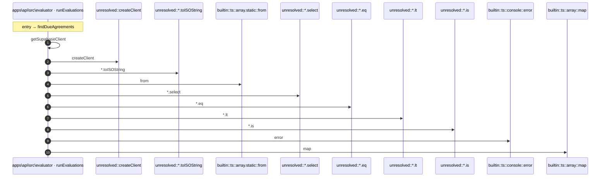

# Process: findDueAgreements flow

11 steps across 1 files. Entry: `apps\api\src\evaluator\evaluation-job.ts::findDueAgreements` (score 8.78).

## Flow

## Steps

| # | Depth | Symbol | File |
|---|-------|--------|------|
| 1 | 0 | `findDueAgreements` | `apps\api\src\evaluator\evaluation-job.ts` |
| 2 | 1 | `getSupabaseClient` | `apps\api\src\evaluator\evaluation-job.ts` |
| 3 | 2 | `unresolved::createClient` | `` |
| 4 | 1 | `unresolved::*.toISOString` | `` |
| 5 | 1 | `builtin::ts::array.static::from` | `` |
| 6 | 1 | `unresolved::*.select` | `` |
| 7 | 1 | `unresolved::*.eq` | `` |
| 8 | 1 | `unresolved::*.lt` | `` |
| 9 | 1 | `unresolved::*.is` | `` |
| 10 | 1 | `builtin::ts::console::error` | `` |
| 11 | 1 | `builtin::ts::array::map` | `` |

## Files Touched

- `apps\api\src\evaluator\evaluation-job.ts`

