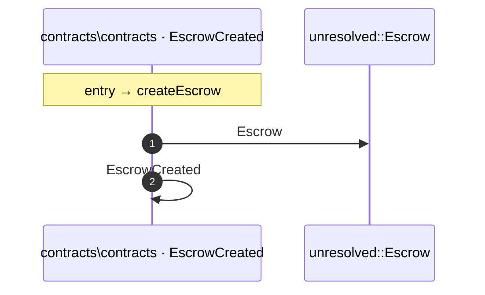

# Process: createEscrow flow

3 steps across 1 files. Entry: `contracts\contracts\SLAEscrow.sol::createEscrow` (score 6.00).

## Flow

## Steps

| # | Depth | Symbol | File |
|---|-------|--------|------|
| 1 | 0 | `createEscrow` | `contracts\contracts\SLAEscrow.sol` |
| 2 | 1 | `unresolved::Escrow` | `` |
| 3 | 1 | `EscrowCreated` | `contracts\contracts\SLAEscrow.sol` |

## Files Touched

- `contracts\contracts\SLAEscrow.sol`

