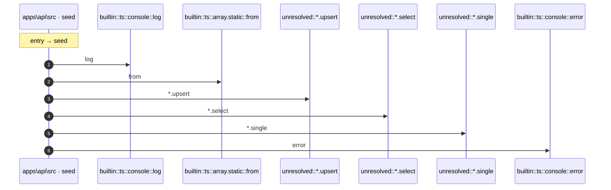

# Process: seed flow

7 steps across 1 files. Entry: `apps\api\src\seed.ts::seed` (score 99.00).

## Flow

## Steps

| # | Depth | Symbol | File |
|---|-------|--------|------|
| 1 | 0 | `seed` | `apps\api\src\seed.ts` |
| 2 | 1 | `builtin::ts::console::log` | `` |
| 3 | 1 | `builtin::ts::array.static::from` | `` |
| 4 | 1 | `unresolved::*.upsert` | `` |
| 5 | 1 | `unresolved::*.select` | `` |
| 6 | 1 | `unresolved::*.single` | `` |
| 7 | 1 | `builtin::ts::console::error` | `` |

## Files Touched

- `apps\api\src\seed.ts`

