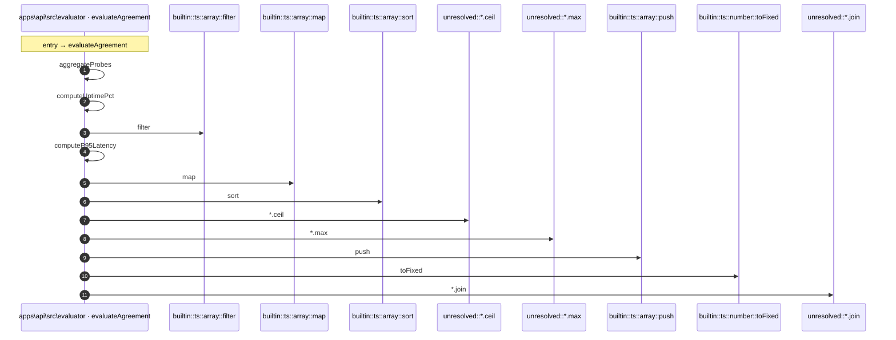

# Process: evaluateAgreement flow

12 steps across 2 files. Entry: `apps\api\src\evaluator\evaluation.ts::evaluateAgreement` (score 4.88).

## Flow

## Steps

| # | Depth | Symbol | File |
|---|-------|--------|------|
| 1 | 0 | `evaluateAgreement` | `apps\api\src\evaluator\evaluation.ts` |
| 2 | 1 | `aggregateProbes` | `apps\api\src\evaluator\aggregation.ts` |
| 3 | 2 | `computeUptimePct` | `apps\api\src\evaluator\aggregation.ts` |
| 4 | 3 | `builtin::ts::array::filter` | `` |
| 5 | 2 | `computeP95Latency` | `apps\api\src\evaluator\aggregation.ts` |
| 6 | 3 | `builtin::ts::array::map` | `` |
| 7 | 3 | `builtin::ts::array::sort` | `` |
| 8 | 3 | `unresolved::*.ceil` | `` |
| 9 | 3 | `unresolved::*.max` | `` |
| 10 | 1 | `builtin::ts::array::push` | `` |
| 11 | 1 | `builtin::ts::number::toFixed` | `` |
| 12 | 1 | `unresolved::*.join` | `` |

## Files Touched

- `apps\api\src\evaluator\aggregation.ts`
- `apps\api\src\evaluator\evaluation.ts`

