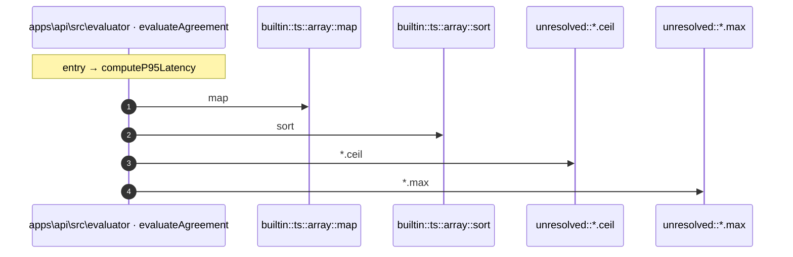

# Process: computeP95Latency flow

5 steps across 1 files. Entry: `apps\api\src\evaluator\aggregation.ts::computeP95Latency` (score 3.90).

## Flow

## Steps

| # | Depth | Symbol | File |
|---|-------|--------|------|
| 1 | 0 | `computeP95Latency` | `apps\api\src\evaluator\aggregation.ts` |
| 2 | 1 | `builtin::ts::array::map` | `` |
| 3 | 1 | `builtin::ts::array::sort` | `` |
| 4 | 1 | `unresolved::*.ceil` | `` |
| 5 | 1 | `unresolved::*.max` | `` |

## Files Touched

- `apps\api\src\evaluator\aggregation.ts`

