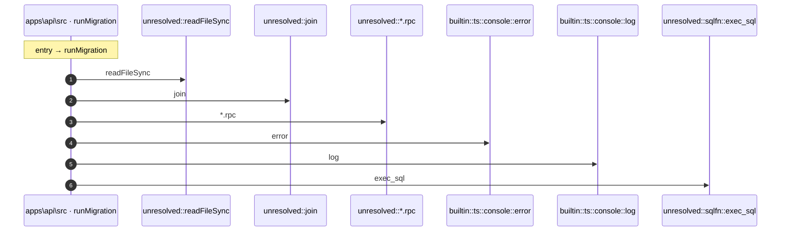

# Process: runMigration flow

7 steps across 1 files. Entry: `apps\api\src\migrate.ts::runMigration` (score 3.38).

## Flow

## Steps

| # | Depth | Symbol | File |
|---|-------|--------|------|
| 1 | 0 | `runMigration` | `apps\api\src\migrate.ts` |
| 2 | 1 | `unresolved::readFileSync` | `` |
| 3 | 1 | `unresolved::join` | `` |
| 4 | 1 | `unresolved::*.rpc` | `` |
| 5 | 1 | `builtin::ts::console::error` | `` |
| 6 | 1 | `builtin::ts::console::log` | `` |
| 7 | 1 | `unresolved::sqlfn::exec_sql` | `` |

## Files Touched

- `apps\api\src\migrate.ts`

