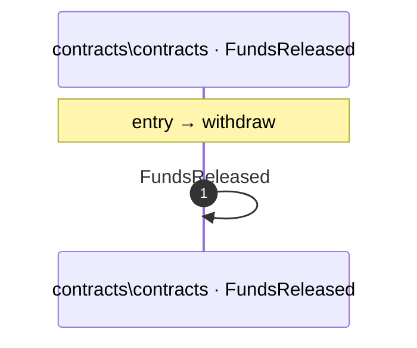

# Process: withdraw flow

2 steps across 1 files. Entry: `contracts\contracts\SLAEscrow.sol::withdraw` (score 3.00).

## Flow

## Steps

| # | Depth | Symbol | File |
|---|-------|--------|------|
| 1 | 0 | `withdraw` | `contracts\contracts\SLAEscrow.sol` |
| 2 | 1 | `FundsReleased` | `contracts\contracts\SLAEscrow.sol` |

## Files Touched

- `contracts\contracts\SLAEscrow.sol`

