# Process: DashboardPage flow

20 steps across 1 files. Entry: `apps\web\src\app\dashboard\page.tsx::DashboardPage` (score 78.00).

## Flow

```mermaid
sequenceDiagram
  autonumber
  participant c_apps\web\src\app\dashboard as apps\web\src\app\dashboard
  participant n_unresolved_useRouter as unresolved::useRouter
  participant n_unresolved_useState as unresolved::useState
  participant n_unresolved_useEffect as unresolved::useEffect
  participant n_unresolved___getSession as unresolved::*.getSession
  participant n_builtin_ts_array_push as builtin::ts::array::push
  participant n_builtin_ts_array_static_from as builtin::ts::array.static::from
  participant n_unresolved___select as unresolved::*.select
  participant n_unresolved___eq as unresolved::*.eq
  participant n_unresolved___single as unresolved::*.single
  participant n_unresolved_setOrgName as unresolved::setOrgName
  participant n_unresolved___getProviders as unresolved::*.getProviders
  participant n_builtin_ts_promise_static_all as builtin::ts::promise.static::all
  participant n_builtin_ts_array_map as builtin::ts::array::map
  participant n_unresolved___getProvider as unresolved::*.getProvider
  participant n_unresolved_setProviders as unresolved::setProviders
  participant n_unresolved_setError as unresolved::setError
  participant n_unresolved_setLoading as unresolved::setLoading
  participant n_unresolved___signOut as unresolved::*.signOut

  Note over c_apps\web\src\app\dashboard: entry → DashboardPage
  c_apps\web\src\app\dashboard->>n_unresolved_useRouter: useRouter
  c_apps\web\src\app\dashboard->>n_unresolved_useState: useState
  c_apps\web\src\app\dashboard->>n_unresolved_useEffect: useEffect
  c_apps\web\src\app\dashboard->>n_unresolved___getSession: *.getSession
  c_apps\web\src\app\dashboard->>n_builtin_ts_array_push: push
  c_apps\web\src\app\dashboard->>n_builtin_ts_array_static_from: from
  c_apps\web\src\app\dashboard->>n_unresolved___select: *.select
  c_apps\web\src\app\dashboard->>n_unresolved___eq: *.eq
  c_apps\web\src\app\dashboard->>n_unresolved___single: *.single
  c_apps\web\src\app\dashboard->>n_unresolved_setOrgName: setOrgName
  c_apps\web\src\app\dashboard->>n_unresolved___getProviders: *.getProviders
  c_apps\web\src\app\dashboard->>n_builtin_ts_promise_static_all: all
  c_apps\web\src\app\dashboard->>n_builtin_ts_array_map: map
  c_apps\web\src\app\dashboard->>n_unresolved___getProvider: *.getProvider
  c_apps\web\src\app\dashboard->>n_unresolved_setProviders: setProviders
  c_apps\web\src\app\dashboard->>n_unresolved_setError: setError
  c_apps\web\src\app\dashboard->>n_unresolved_setLoading: setLoading
  c_apps\web\src\app\dashboard->>c_apps\web\src\app\dashboard: checkAuthAndFetchData
  c_apps\web\src\app\dashboard->>n_unresolved___signOut: *.signOut
```

## Steps

| # | Depth | Symbol | File |
|---|-------|--------|------|
| 1 | 0 | `DashboardPage` | `apps\web\src\app\dashboard\page.tsx` |
| 2 | 1 | `unresolved::useRouter` | `` |
| 3 | 1 | `unresolved::useState` | `` |
| 4 | 1 | `unresolved::useEffect` | `` |
| 5 | 1 | `unresolved::*.getSession` | `` |
| 6 | 1 | `builtin::ts::array::push` | `` |
| 7 | 1 | `builtin::ts::array.static::from` | `` |
| 8 | 1 | `unresolved::*.select` | `` |
| 9 | 1 | `unresolved::*.eq` | `` |
| 10 | 1 | `unresolved::*.single` | `` |
| 11 | 1 | `unresolved::setOrgName` | `` |
| 12 | 1 | `unresolved::*.getProviders` | `` |
| 13 | 1 | `builtin::ts::promise.static::all` | `` |
| 14 | 1 | `builtin::ts::array::map` | `` |
| 15 | 1 | `unresolved::*.getProvider` | `` |
| 16 | 1 | `unresolved::setProviders` | `` |
| 17 | 1 | `unresolved::setError` | `` |
| 18 | 1 | `unresolved::setLoading` | `` |
| 19 | 1 | `checkAuthAndFetchData` | `apps\web\src\app\dashboard\page.tsx` |
| 20 | 1 | `unresolved::*.signOut` | `` |

## Files Touched

- `apps\web\src\app\dashboard\page.tsx`

