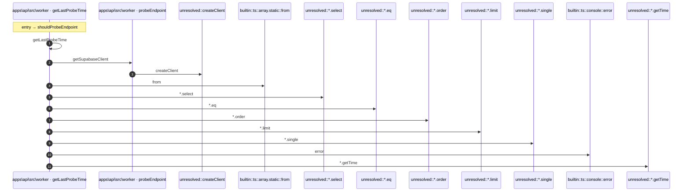

# Process: shouldProbeEndpoint flow

12 steps across 2 files. Entry: `apps\api\src\worker\scheduler.ts::shouldProbeEndpoint` (score 2.93).

## Flow

## Steps

| # | Depth | Symbol | File |
|---|-------|--------|------|
| 1 | 0 | `shouldProbeEndpoint` | `apps\api\src\worker\scheduler.ts` |
| 2 | 1 | `getLastProbeTime` | `apps\api\src\worker\probe-runner.ts` |
| 3 | 2 | `getSupabaseClient` | `apps\api\src\worker\probe-runner.ts` |
| 4 | 3 | `unresolved::createClient` | `` |
| 5 | 2 | `builtin::ts::array.static::from` | `` |
| 6 | 2 | `unresolved::*.select` | `` |
| 7 | 2 | `unresolved::*.eq` | `` |
| 8 | 2 | `unresolved::*.order` | `` |
| 9 | 2 | `unresolved::*.limit` | `` |
| 10 | 2 | `unresolved::*.single` | `` |
| 11 | 2 | `builtin::ts::console::error` | `` |
| 12 | 1 | `unresolved::*.getTime` | `` |

## Files Touched

- `apps\api\src\worker\probe-runner.ts`
- `apps\api\src\worker\scheduler.ts`

