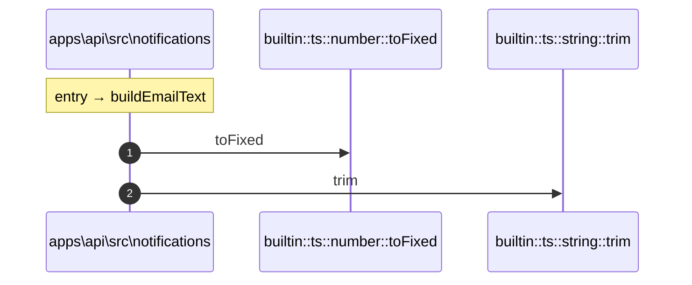

# Process: buildEmailText flow

3 steps across 1 files. Entry: `apps\api\src\notifications\email.ts::buildEmailText` (score 1.95).

## Flow

## Steps

| # | Depth | Symbol | File |
|---|-------|--------|------|
| 1 | 0 | `buildEmailText` | `apps\api\src\notifications\email.ts` |
| 2 | 1 | `builtin::ts::number::toFixed` | `` |
| 3 | 1 | `builtin::ts::string::trim` | `` |

## Files Touched

- `apps\api\src\notifications\email.ts`

