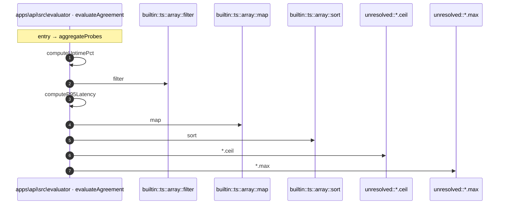

# Process: aggregateProbes flow

8 steps across 1 files. Entry: `apps\api\src\evaluator\aggregation.ts::aggregateProbes` (score 1.95).

## Flow

## Steps

| # | Depth | Symbol | File |
|---|-------|--------|------|
| 1 | 0 | `aggregateProbes` | `apps\api\src\evaluator\aggregation.ts` |
| 2 | 1 | `computeUptimePct` | `apps\api\src\evaluator\aggregation.ts` |
| 3 | 2 | `builtin::ts::array::filter` | `` |
| 4 | 1 | `computeP95Latency` | `apps\api\src\evaluator\aggregation.ts` |
| 5 | 2 | `builtin::ts::array::map` | `` |
| 6 | 2 | `builtin::ts::array::sort` | `` |
| 7 | 2 | `unresolved::*.ceil` | `` |
| 8 | 2 | `unresolved::*.max` | `` |

## Files Touched

- `apps\api\src\evaluator\aggregation.ts`

