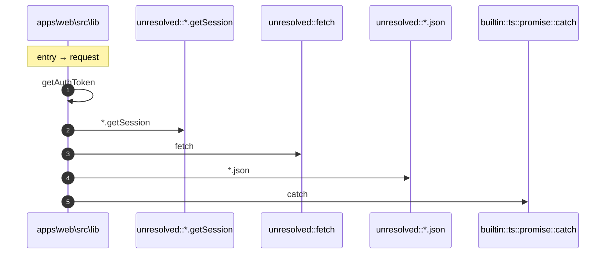

# Process: request flow

6 steps across 1 files. Entry: `apps\web\src\lib\api.ts::APIClient.request` (score 1.50).

## Flow

## Steps

| # | Depth | Symbol | File |
|---|-------|--------|------|
| 1 | 0 | `request` | `apps\web\src\lib\api.ts` |
| 2 | 1 | `getAuthToken` | `apps\web\src\lib\api.ts` |
| 3 | 2 | `unresolved::*.getSession` | `` |
| 4 | 1 | `unresolved::fetch` | `` |
| 5 | 1 | `unresolved::*.json` | `` |
| 6 | 1 | `builtin::ts::promise::catch` | `` |

## Files Touched

- `apps\web\src\lib\api.ts`

