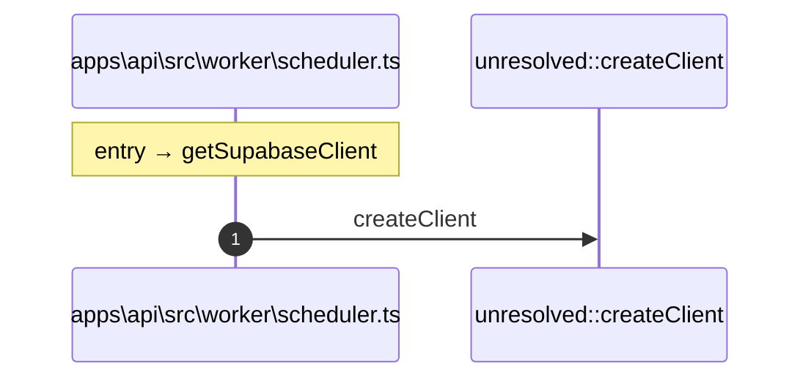

# Process: getSupabaseClient flow

2 steps across 1 files. Entry: `apps\api\src\worker\scheduler.ts::getSupabaseClient` (score 1.50).

## Flow

## Steps

| # | Depth | Symbol | File |
|---|-------|--------|------|
| 1 | 0 | `getSupabaseClient` | `apps\api\src\worker\scheduler.ts` |
| 2 | 1 | `unresolved::createClient` | `` |

## Files Touched

- `apps\api\src\worker\scheduler.ts`

