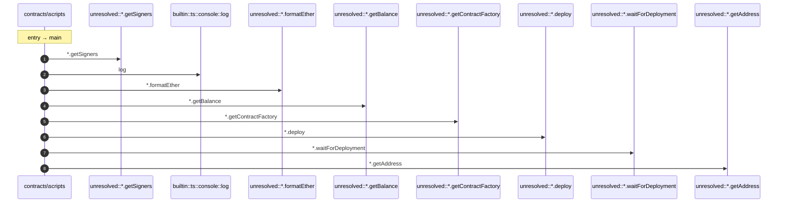

# Process: main execution

9 steps across 1 files. Entry: `contracts\scripts\deploy.ts::main` (score 72.00).

## Flow

## Steps

| # | Depth | Symbol | File |
|---|-------|--------|------|
| 1 | 0 | `main` | `contracts\scripts\deploy.ts` |
| 2 | 1 | `unresolved::*.getSigners` | `` |
| 3 | 1 | `builtin::ts::console::log` | `` |
| 4 | 1 | `unresolved::*.formatEther` | `` |
| 5 | 1 | `unresolved::*.getBalance` | `` |
| 6 | 1 | `unresolved::*.getContractFactory` | `` |
| 7 | 1 | `unresolved::*.deploy` | `` |
| 8 | 1 | `unresolved::*.waitForDeployment` | `` |
| 9 | 1 | `unresolved::*.getAddress` | `` |

## Files Touched

- `contracts\scripts\deploy.ts`

