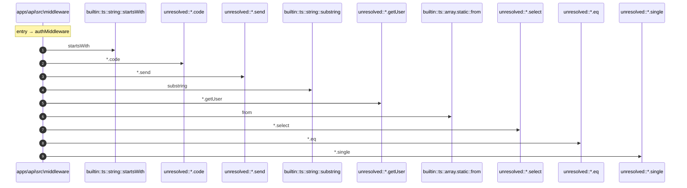

# Process: authMiddleware flow

10 steps across 1 files. Entry: `apps\api\src\middleware\auth.ts::authMiddleware` (score 67.50).

## Flow

## Steps

| # | Depth | Symbol | File |
|---|-------|--------|------|
| 1 | 0 | `authMiddleware` | `apps\api\src\middleware\auth.ts` |
| 2 | 1 | `builtin::ts::string::startsWith` | `` |
| 3 | 1 | `unresolved::*.code` | `` |
| 4 | 1 | `unresolved::*.send` | `` |
| 5 | 1 | `builtin::ts::string::substring` | `` |
| 6 | 1 | `unresolved::*.getUser` | `` |
| 7 | 1 | `builtin::ts::array.static::from` | `` |
| 8 | 1 | `unresolved::*.select` | `` |
| 9 | 1 | `unresolved::*.eq` | `` |
| 10 | 1 | `unresolved::*.single` | `` |

## Files Touched

- `apps\api\src\middleware\auth.ts`

