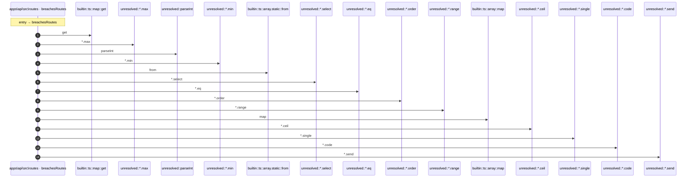

# Process: breachesRoutes flow

15 steps across 1 files. Entry: `apps\api\src\routes\breaches.ts::breachesRoutes` (score 66.00).

## Flow

## Steps

| # | Depth | Symbol | File |
|---|-------|--------|------|
| 1 | 0 | `breachesRoutes` | `apps\api\src\routes\breaches.ts` |
| 2 | 1 | `builtin::ts::map::get` | `` |
| 3 | 1 | `unresolved::*.max` | `` |
| 4 | 1 | `unresolved::parseInt` | `` |
| 5 | 1 | `unresolved::*.min` | `` |
| 6 | 1 | `builtin::ts::array.static::from` | `` |
| 7 | 1 | `unresolved::*.select` | `` |
| 8 | 1 | `unresolved::*.eq` | `` |
| 9 | 1 | `unresolved::*.order` | `` |
| 10 | 1 | `unresolved::*.range` | `` |
| 11 | 1 | `builtin::ts::array::map` | `` |
| 12 | 1 | `unresolved::*.ceil` | `` |
| 13 | 1 | `unresolved::*.single` | `` |
| 14 | 1 | `unresolved::*.code` | `` |
| 15 | 1 | `unresolved::*.send` | `` |

## Files Touched

- `apps\api\src\routes\breaches.ts`

